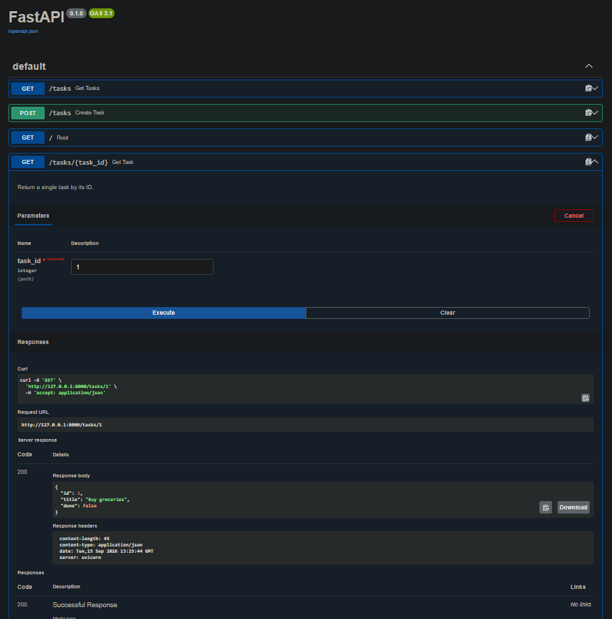

# Task API (BE-01)

A small CRUD API for managing a to-do list, built with FastAPI. Data is stored in memory only (resets when the server restarts)

## Run it

pip install -r requirements.txt
uvicorn main:app --reload --port 8000

Then visit http://localhost:8000/docs for interactive docs.

## Endpoints

| Method | Path        | Description    |
| ------ | ----------- | -------------- |
| GET    | /           | API info       |
| GET    | /health     | Health check   |
| GET    | /tasks      | List all tasks |
| GET    | /tasks/{id} | Get one task   |
| POST   | /tasks      | Create a task  |
| PUT    | /tasks/{id} | Update a task  |
| DELETE | /tasks/{id} | Delete a task  |

## Example

curl -i -X POST http://localhost:8000/tasks -H "Content-Type: application/json" -d "{\"title\":\"Buy milk\"}"

### Output

HTTP/1.1 201 Created
date: Tue, 15 Sep 2026 13:16:01 GMT
server: uvicorn
content-length: 40
content-type: application/json

{"id":4,"title":"Buy milk","done":false}

## Swagger UI

